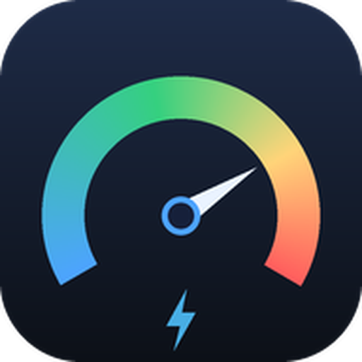
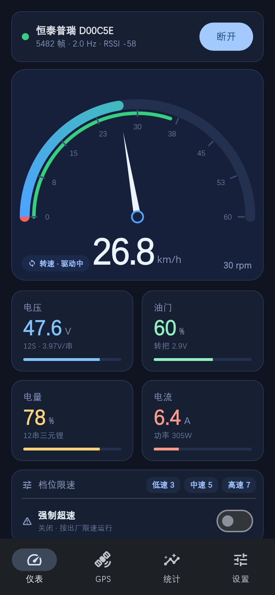
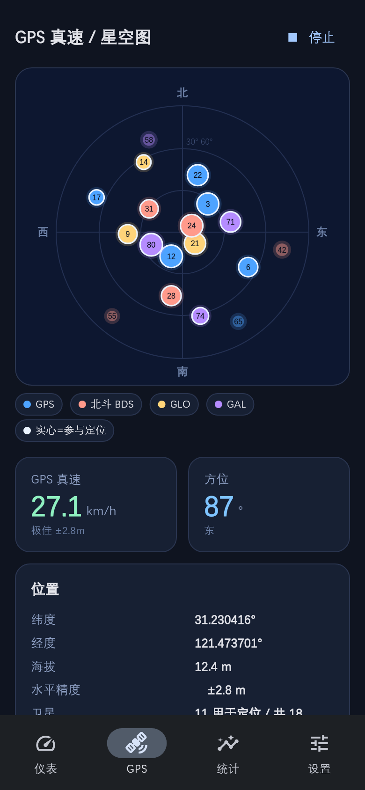
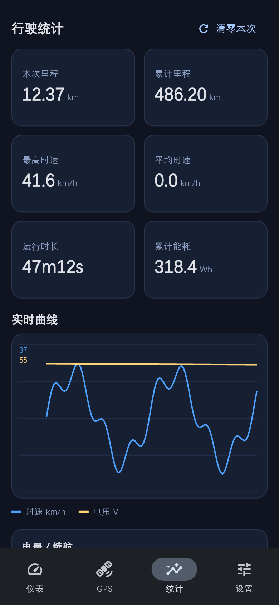
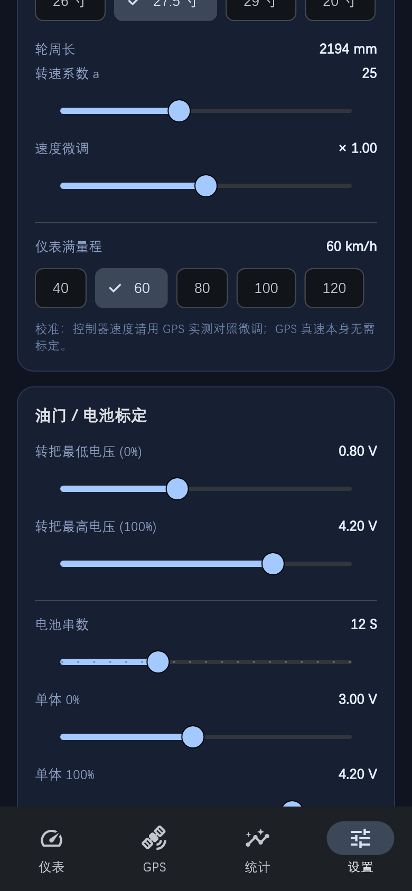

<div align="center">



# 恒泰普瑞控制器 · BLE 调试控制台

**HTPR E-Bike BLE Console** &nbsp;·&nbsp; 用手机直连电动自行车控制器，读到电压 / 电流 / 电机转速 / 转把电压，
并把转速换算成时速显示在竖屏仪表上。

[](LICENSE)
[](https://flutter.dev)
[](https://www.android.com)
[](../../releases/latest)

[**⬇ 下载 APK**](../../releases/latest) &nbsp;·&nbsp;
[使用场景](#-使用场景) &nbsp;·&nbsp;
[技术架构](#-技术架构) &nbsp;·&nbsp;
[BLE 协议](#-ble-协议) &nbsp;·&nbsp;
[从源码构建](#-从源码构建)

</div>

---

<table>
<tr>
<td width="25%"></td>
<td width="25%"></td>
<td width="25%"></td>
<td width="25%"></td>
</tr>
<tr align="center">
<td><b>仪表盘</b><br><sub>半圆仪表 · 速度源徽标 · 档位速览</sub></td>
<td><b>GNSS</b><br><sub>卫星天空图 · 定位质量</sub></td>
<td><b>统计</b><br><sub>里程 / 能耗 / 实时曲线</sub></td>
<td><b>设置</b><br><sub>轮径 / 电池 / 量程标定</sub></td>
</tr>
</table>

> 截图由 `flutter_console/test/screenshots_test.dart` 用**真实 Widget 渲染**导出，与真机界面一致；
> 该测试同时是布局溢出回归 —— 任何 `RenderFlex overflow` 都会让它失败。

---

## 📌 这个项目解决什么问题

恒泰普瑞（HTPR）系列无刷电机控制器只提供微信小程序作为上位机，官方 App 缺失，
且**只能看、不能留存、无法二次开发**。本项目做了三件事：

1. **逆向出 BLE 通信协议** —— 模块走 Nordic UART Service 透传，67 字节定长帧，
   载荷区被一层自研混淆（非标准加密）保护。协议已完整还原，见 [`tools/PROTOCOL.md`](tools/PROTOCOL.md)。
2. **提供一个可用的原生控制台** —— Flutter 编写，竖屏仪表为主界面，
   实时显示时速 / 电压 / 电流 / 电量 / 里程，并下发三档限速与强制超速指令。
3. **解决「转速推算时速不准」** —— 控制器转速字段在松油门滑行时**恒为 0**（固件限制，
   官方小程序同样如此），因此设计了 **GNSS 在环动态标定 + 三速度源融合**方案。

---

## 🎯 使用场景

### ✅ 适合

| 场景 | 说明 |
|---|---|
| **控制器参数核对** | 万用表对不上官方读数时，直接读原始转把电压（0.005 V 分辨率）、电流、串均压，判断是转把问题还是控制器采样问题 |
| **改装后功能验证** | 换电池组、换轮组、换转把后，核对电压 / 电流 / 电量换算是否符合预期 |
| **骑行码表** | 手机固定在车把上，竖屏半圆仪表 + 电压 + 电量，比多数低价码表信息密度高 |
| **限速调试** | 在封闭场地调整三档限速值、验证强制超速是否生效 |
| **转速↔时速标定** | 用 GNSS 真值反标定，跑几段路即可让转速推算时速收敛到真值 |
| **协议二次开发** | 想移植到 ESP32 / iOS / 树莓派？[`tools/htpr_protocol.py`](tools/htpr_protocol.py) 是零依赖的 Python 参考实现，含自测用例 |
| **教学 / 射频研究** | 一个完整的「BLE 逆向 → 协议还原 → 产品化」案例，含微信小程序 wxapkg 解密脚本 |

### ❌ 不适合

- **作为法定速度表使用** —— 转速推算存在延迟与标定误差；GPS 在隧道 / 树下会丢失。
  需要计量级精度请用专用码表。
- **其他品牌的控制器** —— 本项目只实现了恒泰普瑞的私有协议。
  除非你确认对方也走 NUS + 同样的帧格式，否则无法直接使用。
- **汽车 / 大功率电摩** —— 电流量程与电池串数换算按 48 V 12 串小电自设计；
  虽可配置，但安全裕度不适用。
- **量产刷机工具** —— 本项目只做「读 + 有限写」，没有固件升级、批量烧录能力。

### ⚠️ 强制超速（功能字 bit9）

这是厂商调试接口，会绕过出厂限速。**只能在封闭场地使用**，
修改前必须抬起车轮。详见文末[安全声明](#️-安全声明)。

---

## ✨ 功能

- **BLE 直连** —— 按 MAC 直连或按名称扫描，自动重连（3 s 重试，连续 6 次失败退避至 15 s）
- **半圆仪表** —— 180° 渐变弧 + 指针 + 油门外弧，量程 40 / 60 / 80 / 100 / 120 km/h 可配
- **速度源徽标** —— 实时标出当前时速来自 `GNSS` 还是 `转速`，以及具体状态（驱动中 / 滑行 / 无定位）
- **四路实时读数** —— 电压（含串均压）、油门 %（含转把电压）、电量 SOC、电流（含功率），均带进度条
- **GNSS 天空图** —— 原生 `GnssStatus` 取卫星方位角 / 仰角 / 载噪比，按星座着色，实心圈 = 参与定位
- **行驶统计** —— 本次 / 累计里程、最高 / 平均时速、运行时长、累计能耗、实时曲线
- **档位速览与超速开关** —— 仪表页可直接看三档限速值、一键切换强制超速
- **完整标定面板** —— 轮径、转速系数、速度微调、转把上下限、电池串数与单体截止电压
- **在线动态标定** —— GPS 作真值，过原点最小二乘拟合转速→时速系数，带离群剔除
- **启动图标** —— 自适应图标 + Android 13 主题化单色层，由 [`tools/make_icons.py`](tools/make_icons.py) 生成

---

## 🏗 技术架构

### 分层

```
┌──────────────────────────────────────────────────────────────────┐
│  表现层                                                          │
│    main.dart          HomeShell · DashboardPage · GpsPage        │
│    pages_extra.dart   StatsPage · SettingsPage                   │
│    CustomPainter      SpeedometerPainter · SkyplotPainter ·      │
│                       LineChartPainter                           │
├──────────────────────────────────────────────────────────────────┤
│  状态层                                                          │
│    app_state.dart     ChangeNotifier 单例 AppState.I             │
│                       速度模式 / 在线标定 / 里程能耗积分 /        │
│                       SharedPreferences 持久化                    │
├──────────────────────────────────────────────────────────────────┤
│  服务层                                                          │
│    ble_service.dart   扫描 · 连接 · NUS 订阅 · 断线重连 · 下发    │
│    gnss_service.dart  EventChannel 消费 · Sat 模型 · 定位质量      │
├──────────────────────────────────────────────────────────────────┤
│  协议层                                                          │
│    htpr_protocol.dart 解密 / 加密 / 校验 / 解析 / 组帧            │
│                       Dashboard · Realtime 数据模型              │
├──────────────────────────────────────────────────────────────────┤
│  原生层 (Kotlin)                                                 │
│    GnssBridge.kt      GnssStatus.Callback + LocationManager      │
│                       卫星 az / el / cn0 / usedInFix → JSON      │
│    MainActivity.kt    注册 EventChannel 'htpr/gnss/stream'        │
└──────────────────────────────────────────────────────────────────┘
```

### 数据流

```
 控制器 ──BLE notify──▶ BleService._onFrame
                              │
                              ▼
                    HtprProtocol.parse()        ← 解密 + 校验和
                              │
                     ┌────────┴────────┐
                     ▼                 ▼
               Dashboard(仪表帧)   Realtime(遥测帧)
              电压/转把电压/功能字  电流/转速/motion1,2
                     └────────┬────────┘
                              ▼
                      AppState._onBle()
                              │
        ┌─────────────────────┼─────────────────────┐
        ▼                     ▼                     ▼
 _updateCalibration()    _pickSpeed()           _tick() @200ms
  过原点最小二乘          三源选择 + 指数平滑      里程/能耗/曲线积分
  K = Σ(xy)/Σ(x²)        τ = 0.35s / 0.55s      1 Hz 采样入 history
        └─────────────────────┼─────────────────────┘
                              ▼
                       notifyListeners()
                              ▼
                         UI setState 重绘
```

### 关键设计决策

**① 为什么不用 `geolocator` 取卫星数据？**

`geolocator` 只暴露「可见卫星数」这一个整数，拿不到每颗星的方位角 / 仰角 / 载噪比，
画不出天空图。因此写了 Kotlin 侧的 `GnssBridge.kt`，用 `GnssStatus.Callback`
拿完整的 `GnssSatelliteData`，经 EventChannel 推给 Dart。
（参考：`android/app/src/main/kotlin/com/htpr/htpr_console/GnssBridge.kt`）

**② 为什么速度要分三源？**

控制器转速字段是**短窗口霍尔计数**：低速时计数窗口不足会间歇性掉 0；
松油门滑行时干脆恒为 0（官方小程序表现一致，属固件行为，非解析错误）。所以：

| 模式 | 行为 | 适用 |
|---|---|---|
| `GPS` | 只用 GNSS 真速，无定位时回落转速 | 空旷路段，追求真值 |
| `融合`（默认） | 驱动中 → 转速（低延迟、隧道可用）；油门 < 3% 或转速掉零 → GNSS | 日常骑行 |
| `转速` | 只用转速推算（由 GPS 在线标定过的 K） | 无 GPS / 室内 |

融合模式的速度源切换带 0.35 s 时间常数的指数平滑，避免模式跳变时指针跳动；
纯转速模式用 0.55 s。`_rpmWithHold()` 对掉零帧做惯性衰减补偿（最多 4 帧）。

**③ GNSS 在环动态标定**

模型 `speed(km/h) = K · rotRaw`，K 用**过原点最小二乘**在线拟合：

```
采样条件： 油门 > 12%  ·  GPS 精度 < 20 m  ·  GPS 速度 > 3 km/h  ·  rotRaw > 40
离群剔除： 单次样本 K 落在 [0.35·K₀, 3.0·K₀] 之外则丢弃
累积更新： K = Σ(gps · raw) / Σ(raw²)     样本 ≥ 6 后自动生效
```

出厂系数 `K₀ = (1/a) · C · 60/1000`，其中 `a` 是官方转速系数（默认 25），
`C` 是轮周长（27.5″ ≈ 2194 mm），得到 `K₀ ≈ 0.005267`。
实测标定后 `K/K₀ ≈ 1.16`，说明官方系数偏保守。

---

## 📡 BLE 协议

完整文档见 [`tools/PROTOCOL.md`](tools/PROTOCOL.md)，下面是速览。

### 传输层：Nordic UART Service

| 用途 | UUID |
|---|---|
| Service | `6e400001-b5a3-f393-e0a9-e50e24dcca9e` |
| Write（手机 → 控制器） | `6e400002-b5a3-f393-e0a9-e50e24dcca9e` |
| Notify（控制器 → 手机） | `6e400003-b5a3-f393-e0a9-e50e24dcca9e` |

> 模块**同一时刻只允许一个中心设备连接**，接入后会停止广播。
> 如果官方小程序连着，本 App 会连不上 —— 请先在小程序里断开。

### 帧结构：67 字节定长，约 2 Hz

```
┌────┬────┬────┬────┬──────────────────────────────┬──────┬──────┐
│ 0  │ 1  │ 2  │ 3  │        4 …… 65 (62 B)        │  65  │  66  │
├────┴────┴────┴────┼──────────────────────────────┼──────┼──────┤
│   帧头（2 种）     │   混淆载荷（逐字节变换）      │ 校验 │ 0xCC │
└───────────────────┴──────────────────────────────┴──────┴──────┘
```

| 帧头 | 类型 | 承载 |
|---|---|---|
| `C9 9C 94 05` | 仪表帧 | 电压、转把电压、功能设置字、motion3 |
| `CA AC 96 05` | 遥测帧 | 电流、转速、motion1 / motion2 |

**载荷混淆**（byte 4…65 逐字节，`o` 为字节下标）：

```
解密: b = (b - 54) & 0xFF;  b ^= 43;  b = (b - o) & 0xFF;  b ^= 101;  b = (b - o) & 0xFF
加密: b = (b + o) & 0xFF;   b ^= 101;  b = (b + o) & 0xFF;  b ^= 43;   b = (b + 54) & 0xFF
```

字节 0–3 与 66 不参与变换。**两种帧都要解密** —— 这是早期字段长期错位的根因。

**校验**：`sum(decrypted[0..64]) & 0xFF == decrypted[65]`，末尾 `decrypted[66] == 0xCC`。

### 字段映射（解密后，大端）

| 字段 | 偏移 | 换算 | 所属帧 |
|---|---|---|---|
| 电压 | `BE(63,64)` | `/100` V | 仪表帧 |
| 转把电压 | `BE(37,38)` | `/200` V | 仪表帧 |
| 功能设置字 | `BE(44,45)` | 16 bit，bit9 = 强制超速 | 仪表帧 |
| motion3 | `u8(51)` | 高速档限速值 | 仪表帧 |
| 电流 | `BE(19,20)` | `/10` A | 遥测帧 |
| 转速原始值 | `BE(21,22)` | `×20` | 遥测帧 |
| 转速显示 | 同上 | `raw / a`（`a` = 25） | 遥测帧 |
| motion1 / motion2 | `u8(11)` / `u8(12)` | 低速 / 中速档限速值 | 遥测帧 |

### 实测校验数据

| 状态 | 电压 | 转把电压 | 电流 | 转速 | 备注 |
|---|---|---|---|---|---|
| 静置 | 48.2 V | 0.8 V | 0.0 A | 0 | 与万用表一致 |
| 低速 | 48.0 V | 1.5 V | 0.1 A | 76 | |
| 空载高速 | 47.5 V | 3.5 V | 1.2–1.3 A | 600–604 | |
| 负载高速 | 47.2 V | 3.5 V | 1.8–13.5 A | 524–600 | |

---

## 📂 目录结构

```
htpr-ble-console/
├── htpr-console-v6.apk          # 交付产物（同时发布在 GitHub Release）
├── flutter_console/             # Flutter / Android 工程（Android Studio 可直接打开）
│   ├── lib/
│   │   ├── main.dart            # 外壳 · 仪表盘 · GNSS 页 · SpeedometerPainter
│   │   ├── pages_extra.dart     # 统计页 · 设置页 · LineChartPainter
│   │   ├── app_state.dart       # 全局状态 · 速度融合 · 在线标定 · 统计
│   │   ├── ble_service.dart     # BLE 扫描 / 连接 / 订阅 / 重连 / 下发
│   │   ├── gnss_service.dart    # GNSS EventChannel 消费
│   │   └── htpr_protocol.dart   # 协议：解密 / 校验 / 解析 / 组帧
│   ├── android/app/src/main/
│   │   ├── kotlin/com/htpr/htpr_console/
│   │   │   ├── MainActivity.kt  # EventChannel 注册
│   │   │   └── GnssBridge.kt    # GnssStatus + LocationManager 桥
│   │   └── res/mipmap-*/        # 启动图标（含自适应与单色层）
│   └── test/screenshots_test.dart  # 真实渲染截图 + 布局溢出回归
├── tools/                       # 逆向与验证工具
│   ├── PROTOCOL.md              # 完整协议文档
│   ├── htpr_protocol.py         # 零依赖 Python 参考实现
│   ├── selftest.py              # 协议回归测试（全部通过）
│   ├── make_icons.py            # 生成 Android 启动图标
│   ├── ble_bridge.py / app.py   # PC 端 BLE 桥 + Flask 网页仪表
│   └── captures/                # 实测抓包样本
├── reverse/                     # 逆向溯源资料
│   ├── app_dec.wxapkg           # 解密后的微信小程序包
│   ├── pc_wxapkg_decrypt_ref.py # wxapkg 解密脚本
│   └── app_src/                 # 反编译源码（101 文件）
├── docs/icon.png                # 图标预览
├── LICENSE                      # MIT + 安全声明
└── README.md
```

---

## 🔧 从源码构建

### 环境要求

| 依赖 | 版本 |
|---|---|
| Flutter SDK | ≥ 3.24（本项目在 3.47.5 / Dart 3.13.4 验证） |
| JDK | 17 |
| Android SDK | `compileSdk 36` / `targetSdk 36` / `minSdk 23`，build-tools 35+ |
| Android 设备 | Android 8.0+，支持 BLE（`android.hardware.bluetooth_le`） |

### 构建

```bash
cd flutter_console
flutter pub get
flutter build apk --release
# 产物：build/app/outputs/flutter-apk/app-release.apk
```

### 运行测试

```bash
cd flutter_console
flutter analyze                # 静态检查
flutter test                   # 截图回归（布局溢出会让测试失败）

cd ../tools
python selftest.py             # 协议回归：解密 / 校验 / 解析 / 组帧
python make_icons.py           # 重新生成启动图标
```

> **国内网络提示**：`maven.google.com` / `plugins.gradle.org` / `services.gradle.org`
> 往往不可达。本仓库的构建依赖一份 Gradle 全局初始化脚本，把所有仓库重写到
> 阿里云 / 腾讯镜像。若构建卡在依赖下载，请自建 `~/.gradle/init.gradle`
> 做同样的仓库重写，或参考 [`tools/PROTOCOL.md`](tools/PROTOCOL.md) 末尾的说明。

### 依赖

| 包 | 用途 |
|---|---|
| `flutter_blue_plus ^2.3.12` | BLE 扫描 / 连接 / GATT |
| `permission_handler 11.3.1` | 定位与蓝牙运行时权限（**锁定版本**：新版要求 compileSdk 37） |
| `shared_preferences ^2.5.5` | 标定参数与里程持久化 |
| `fl_chart ^1.2.0` | 图表依赖（当前页面用自绘 `LineChartPainter`，保留供后续扩展） |

---

## ⚠️ 已知限制

- **转速字段在滑行时恒为 0** —— 控制器固件行为，官方小程序表现一致。
  这是本项目引入 GNSS 融合与在线标定的直接原因。
- **低速时转速间歇掉零** —— 短窗口霍尔计数不足；`_rpmWithHold()` 用惯性衰减补最多 4 帧。
- **模块单连接** —— 与官方小程序互斥，需先断开小程序。
- **仅 Android** —— `flutter_blue_plus` 与自写 Kotlin GNSS 桥均只实现了 Android 侧。
- **无固件升级能力** —— 只做遥测读取与有限参数下发。

---

## 🛡️ 安全声明

> **强制超速**（功能字 bit9）是厂商调试接口，会绕过出厂限速。

- 任何限速 / 档位 / 超速操作**只能在封闭场地**进行；
- 修改参数前**抬起车轮**，确认场地内无人无车；
- 遵守当地关于电动自行车上路速度与改装的强制法规；
- 本项目按 MIT 协议「原样」提供，作者不对车辆损坏、人身伤害或法律后果负责。

完整条款见 [LICENSE](LICENSE)。

---

## 🙏 致谢与溯源

协议还原依赖对微信小程序 `V1MMWX` 包格式的静态分析：
解密流程为 PBKDF2（salt = `saltiest`）+ AES-CBC（iv = `the iv: 16 bytes`）
+ 单字节 XOR（key = `ord(appid[-2])`），脚本见 `reverse/pc_wxapkg_decrypt_ref.py`。

本项目仅用于对**自有设备**的互操作与调试，未分发任何厂商固件或闭源二进制。

---

## 📄 许可

[MIT License](LICENSE) © 2026 BI7KHI
